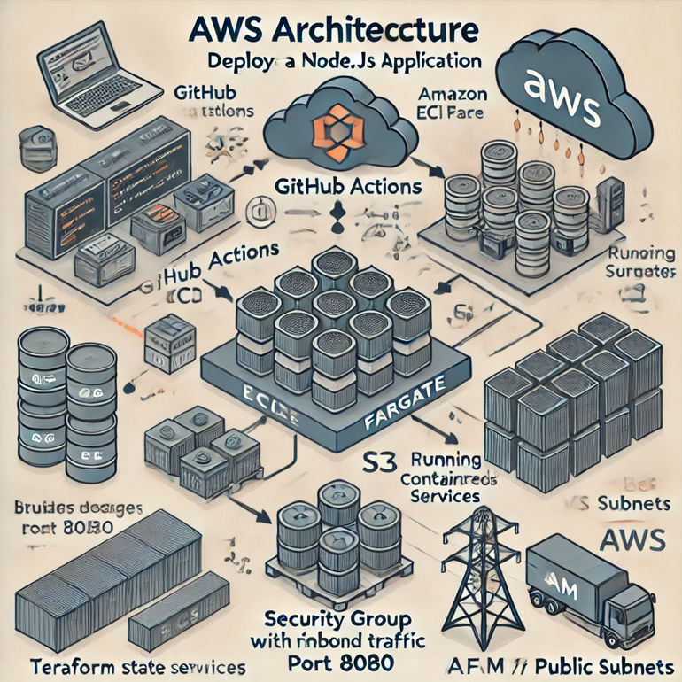

# ce6-Capstone-Project-grp1 : CI/CD with GitHub Actions, Terraform, and AWS

## Overview
This project automates deployments using GitHub Actions and Terraform. The pipeline manages both DEV and PROD environments hosted on AWS, with infrastructure configurations stored in Terraform Cloud.

## The Team Consist of:
- Jyoti Rani
- Kerenp
- Saravanan.B
- VVenila

# Architecture Diagram

 

## List of AWS Resources used in this Project: ##

**1. GitHub Actions** – Automates the CI/CD pipeline.

**2. Amazon ECR** – Stores Docker images for different environments (dev, stage, prod).

**3. Amazon ECS Fargate** – Runs containerized services without managing infrastructure.

**4. Security Group** – Manages network access, allowing HTTP traffic on port 8080.

# **5. Amazon S3** – Stores Terraform state files.

**6. VPC and Public Subnets** – Provides networking and connectivity for the ECS tasks.

**7. IAM Roles and Policies** – Manages access to AWS resources from ECS and GitHub Actions.

### Architecture

**1.** Source Code Management:
GitHub hosts the code and triggers workflows on specific events like pull requests or merges.

**2.** CI/CD Workflow:
GitHub Actions handles the CI/CD process with distinct workflows for:

- **Development (DEV)** environment
- **Production (PROD)** environment

**3.** Infrastructure as Code (IaC):
Terraform Cloud manages the infrastructure definitions for both environments.

**4.** Cloud Provider:
AWS hosts the deployed resources such as ECR,ECS &Fargate,etc.. for the DEV and PROD environments.

## Workflow Explanation

**1. Workflow Invocation:**

- GitHub triggers the workflow on code commits or pull requests.

- The workflow file defines the stages: build, test, plan, and deploy.

**2. DEV and PROD Environments:**

- Separate workflows ensure that changes are validated in DEV before reaching PROD.

- The **Terraform Cloud** plan is applied to the respective AWS environment after successful tests.

## Folder Structure

## Usage Instructions

**1. Setup Terraform Cloud:**

- Link Terraform Cloud with your repository.
- Define workspaces for dev and prod.

**2. Configure GitHub Secrets:**

- Store AWS credentials in GitHub Secrets and variables stored in github enviorments.

**3. Triggering Workflows:**

- Push code to the dev branch to trigger the DEV workflow.

- Test -> Build -> deploy to dev -> After Approval -> deploy to prod

- Merge to main to trigger the PROD workflow.

## Architecture Overview
Here’s how the system works across different environments:

#### 1. GitHub Actions Workflow:

- Developers push code changes to the repository on dev branches.

- After approval Production team to push code changes to the repository on prod branches.

#### 2. Docker Image Build and Push:

The CI/CD pipeline builds a Docker image from the code and pushes it to AWS ECR.

#### 3. ECS Cluster Deployment: ####

ECS clusters (dev-cluster) are configured with services and containers running on Fargate.

#### 4. Networking and Security:

Each ECS cluster is deployed within a VPC using public subnets and security groups.
The security group allows HTTP traffic on port 8080 to access the running containers.

### Architecture Flow for ECS with GitHub Actions CI/CD

#### 1. GitHub Actions (CI/CD Pipeline)

**Input:** Developers push code to different branches (dev, stage, prod).

**Action:**

- Builds Docker images.

- Pushes these images to AWS ECR (Elastic Container Registry).

- Updates ECS task definitions with the new image.

- Deploys to ECS clusters for the appropriate environment.

#### 2. AWS ECR (Elastic Container Registry)

- Stores Docker images, tagged with versions like latest or commit SHA (:abc123).

- GitHub Actions authenticates and pushes images to specific repositories (dev or prod).

#### 3.AWS ECS Clusters (Dev or Prod)

**Two Clusters:**

- dev-cluster: Used for development and early testing.

- prod-cluster: The live environment for end-users.

#### 4. AWS Fargate Tasks & Services

ECS services run **Node.js containers** inside **Fargate tasks.**

Each service is exposed on **port 8080.**

#### 5. Networking Components

**VPC with Public Subnets:** Each cluster resides inside a Virtual Private Cloud (VPC) with public-facing subnets.

**Security Groups:** Allow **inbound HTTP traffic on port 8080** and permit all outbound traffic.

#### 6. Deployment Flow

**Push to GitHub → Build Image → Push to ECR → Deploy to ECS (Dev or Prod)**

## **Deployment Process:**

This project is a Node.js web application containerized with Docker and deployed on AWS Elastic Container Service (ECS) using Fargate. The infrastructure and service deployment are managed with Terraform, while the CI/CD pipeline is set up using GitHub Actions to automate the build and deployment process.

### Prerequisites :
 - Before you begin the deployment, ensure the following are set up:

**AWS Account:** 
  
- You’ll need an AWS account with permissions to create ECS clusters, services, task definitions, and ECR (Elastic Container Registry) repositories.

**Terraform Installed:** 

- Ensure Terraform is installed on your local machine for infrastructure provisioning.

**AWS CLI:**

- Install the AWS CLI for managing AWS resources.

**GitHub Secrets:** 

- Set up the following GitHub secrets in your repository for authentication and deployments:

AWS_ACCESS_KEY_ID

AWS_SECRET_ACCESS_KEY

AWS_REGION
ECR_REPOSITORY_URI (URI of your ECR repository)

**Deployment Steps:**

**1.** Clone the Repository
Start by cloning this repository to your local machine:

 Copy code
git clone https://github.com/your-username/your-repo.git
cd your-repo

**2.** Build the Docker Image
This project is containerized using Docker. The Dockerfile is already provided, which defines how the application is built. You can build the Docker image locally by running:

docker build -t your-application-name .
If you want to test the application locally, run the container by running code:

docker run -p 8080:8080 your-application-name

This will expose the application on http://localhost:8080.

**3.** Infrastructure Provisioning with Terraform
The project uses Terraform to create and manage the AWS resources, including ECS, ECR, and networking components.

To initialize and provision the infrastructure by running below code:

cd envs/dev/infa

terraform init

terraform plan

The Terraform script will:

Set up an ECS Cluster.
Create an ECS Service that runs your Docker container.
Manage networking configurations like Security Groups and Ingress/Egress rules.
Once the Terraform provisioning is complete, your ECS environment is ready to deploy the application.

**4.** Continuous Integration & Deployment with GitHub Actions
The project uses GitHub Actions for CI/CD, automatically building the Docker image, pushing it to ECR, and updating the ECS service.

The workflow is defined in .github/workflows/dev.yml and it performs the following steps:

- Build Docker Image:

    The workflow builds the Docker image for the application based on the Dockerfile.
- Push to ECR:

    Once the image is built, it is pushed to the AWS Elastic Container Registry (ECR).
- Update ECS Task Definition:

    After pushing the image to ECR, the ECS task definition is updated with the new image version.

- Deploy to ECS:

    The ECS service is updated to use the latest task definition, and the new container is deployed to Fargate.

    You can trigger the GitHub Actions workflow by pushing changes to the main branch. The pipeline will automatically handle the deployment.

**5.** Health Check & Monitoring
We recommend adding a health check endpoint (e.g., /health) to your application so ECS can verify the status of your service. 

ECS will periodically send health check requests to this endpoint and ensure the application is running smoothly.

Set up CloudWatch for logging and monitoring ECS tasks:

ECS logs can be streamed to CloudWatch to track any errors or important application events.You can also set up CloudWatch Alarms to monitor the health of your ECS service, such as task failures or high CPU/memory usage.

**6.** Ingress Traffic & Security Considerations
For security purposes, ensure that ingress traffic is only allowed from specific IP ranges or secured over HTTPS. The ECS service security group currently allows traffic from all sources (0.0.0.0/0), but for production environments, it’s recommended to restrict access. Limit to specific trusted IP addresses or regions.Enforce HTTPS by integrating AWS Certificate Manager (ACM) with Application Load Balancer (ALB) or CloudFront for SSL/TLS termination.

**Summary:**

This project leverages Docker for containerization, Terraform for AWS resource management, and GitHub Actions for automating the deployment pipeline. By following the steps outlined above, your Node.js application will be deployed on ECS using AWS Fargate, and the pipeline will automatically rebuild and deploy any changes pushed to the main branch.Make sure to monitor the application’s logs and performance in CloudWatch and ensure security best practices by restricting ingress traffic and enforcing HTTPS for production environments.
